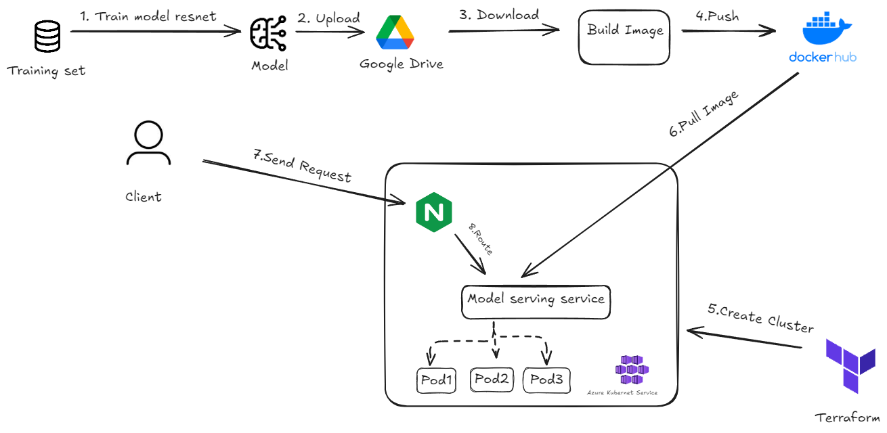

# Motorbike-Classification - MLOPS

### Architecture



# Repo structure
```
├── app: 
│   ├── data
│   ├── utils
│   └── main.py
├── helm-charts:
│   ├── jaeger-tracing
│   ├── model-serving
│   ├── monitoring
│   └── nginx-ingress
├── notebook: 
│   ├── resnet-50.ipynb
│   └── visualize.ipynb
├── terraform
│   ├── main.tf
│   ├── outputs.tf
│   ├── provider.tf
│   ├── README.md
│   ├── ssh.tf
│   └── variables.tf
├── docker-compose.yaml
├── dockerfile
└── requirements.txt
```

## **Table of Contents**
1. [Architecture](#architecture)
2. [Repo Structure](#repo-structure)
3. [API Example](#api-example)
4. [I. How-to Guide](#i-how-to-guide)
## **API Example**
Motorbike Image to classify:
##


##
Returned Result  :


## I. How-to Guide

### 1. Running model locally
#### 1.1 Creating & activating conda environment with python 3.9
```bash
conda create -n my_env python==3.9
conda activate my_env
```

#### 1.2 Install prerequisites
```bash
pip install -r requirements.txt
```

#### 1.3 Navigate to app directory
```bash
cd ./app/
```

#### 1.4 Connect service app with Uvicorn
```bash
uvicorn main:app --host 0.0.0.0 --port 30000
```

#### 1.5 Another way to deploy model locally with Docker Compose
*** If you already have Docker Engine in your local machine, just execute 1 command:
```bash
docker compose -f docker-compose.yaml up -d
```
---
*** When model loading , use command to check
```bash
docker image ls
docker logs img_id
```

### 2. Model-serving with Azure Kubernetes Services (AKS)
#### Install Azure CLI Packages
+ [Install Azure CLI](https://learn.microsoft.com/en-us/cli/azure/install-azure-cli)
```bash
sudo curl -sL https://aka.ms/InstallAzureCLIDeb | sudo bash 
```
+ Setup your Azure project:
- Initialize Azure account:
```bash
  az login
```
#### 2.1 Create AKS cluster with Terraform (infrastruture as code)
```bash
cd terraform # Navigate to terraform folder
terraform plan # Preview cluster plan
terraform apply # Create cluster
```

#### 2.2 Connect to AKS cluster with Suggest command


#### 2.3 Switch to your AKS cluster environment (using [kubectl](https://kubernetes.io/docs/tasks/tools/))
```bash
kubectx your_aks_cluster
```

#### 2.4 Create cluster namespace
```bash
kubectl create ns nginx-ingress # Nginx Ingress Controller
kubectl create ns model-serving
```

#### 2.5 Deploy Nginx Ingress Controller with [Helm-chart](https://helm.sh/)
```bash
helm upgrade --install nginx-ingress helm-charts/nginx-ingress -n nginx-ingress           
```

#### 2.6 Deploy Cat Breed Classification Application
```bash
helm upgrade --install nginx-ingress helm-charts/model-serving -n model-serving           
```

#### 2.7 Config Domain Name to nginx-ingress's External IP
```bash
kubectl get svc --all-namespaces # Listing all services & finding your nginx External IP

sudo vim /etc/hosts # Editting hosts_file with Vim
your_nginx_externalIP 

your_nginx-ingress_host cbp.com # Updated content
```

#### 2.8 Access application at above address http://cbp.com/docs

Because I'm using a free Student Subscription, I don't have enough memory to pull the image size. Instead of running it on the cloud, I am running it on minikube.

Fail because not enough memory :


Result when use minikube  :


